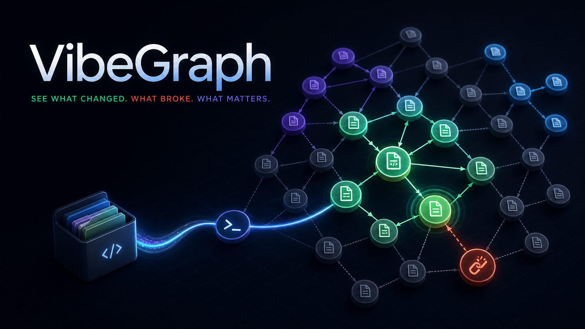

# VibeGraph

**Live codebase maps for AI-powered builders.**

[](https://www.npmjs.com/package/@hoanghieudev/vibegraph)
[](LICENSE)
[](https://vibegraph-hoanghieudev.vercel.app)

VibeGraph is a local-first developer tool that turns a repository into an
interactive file-level dependency graph. It helps you explore architecture,
detect broken dependencies, and choose a focused set of files for an AI coding
task.



## Why VibeGraph?

AI-assisted development moves quickly, but understanding a growing codebase
does not. Sending an entire repository to an AI tool wastes context and makes
dependency assumptions difficult to inspect.

VibeGraph gives you:

- A visual map of files and import relationships.
- Near-real-time warnings when dependencies break.
- Graph-aware file recommendations for a coding task.
- Context-size estimates and copyable `@file` mentions.
- A graph-derived README draft with a Mermaid diagram.
- Local analysis that works without an LLM API key.

## Quick Start

### Requirements

- Node.js 22 or newer
- Python 3.11 or newer

Open a terminal in any project and run:

```bash
npx @hoanghieudev/vibegraph@latest .
```

VibeGraph creates an isolated Python environment in your system cache, scans
the selected project, starts the local runtime, and opens the dashboard at
`http://127.0.0.1:8732`.

To analyze another directory:

```bash
npx @hoanghieudev/vibegraph@latest ./path-to-project
```

## CLI Options

```bash
# Use a different port
npx @hoanghieudev/vibegraph@latest . --port 9000

# Start without opening the browser
npx @hoanghieudev/vibegraph@latest . --no-open

# Select an OpenRouter model
npx @hoanghieudev/vibegraph@latest . \
  --model deepseek/deepseek-v4-flash
```

## What You Can Do

### Explore the codebase

Search for files, inspect imports and importers, view detected exports, switch
between file and module views, and focus on a node's immediate neighborhood.

VibeGraph currently scans:

- Python
- JavaScript and JSX
- TypeScript and TSX

### Detect dependency problems

The file watcher rebuilds the graph after supported files change and reports:

- Broken imports
- Missing exported symbols
- Deleted imported files
- Newly orphaned files
- New circular dependencies

### Generate a context pack

Describe a task such as:

```text
Fix login error handling in auth_routes.py
```

VibeGraph ranks a focused starting set of files using path and symbol matches,
graph distance, file risk, modification recency, and test relevance. The result
includes:

- Recommended files and selection reasons
- Estimated tokens and context reduction
- Copyable file mentions and a suggested prompt
- A local `.vibegraph/context.md` artifact

### Generate a README draft

VibeGraph can generate `.vibegraph/README.generated.md` with an overview,
architecture summary, key modules, run commands, warnings, and a bounded
Mermaid diagram.

## Optional LLM Enhancement

An LLM is not required. Scanning, graph visualization, warnings, context
ranking, and README generation all have deterministic local behavior.

To let an OpenRouter model improve the wording of context packs and README
drafts, set an API key before launching VibeGraph.

macOS or Linux:

```bash
export OPENROUTER_API_KEY="your-openrouter-key"
npx @hoanghieudev/vibegraph@latest . \
  --model deepseek/deepseek-v4-flash
```

Windows PowerShell:

```powershell
$env:OPENROUTER_API_KEY="your-openrouter-key"
npx @hoanghieudev/vibegraph@latest . `
  --model deepseek/deepseek-v4-flash
```

Only structured graph metadata for the deterministically selected files is
sent to OpenRouter. Source-file contents are not sent, and provider failures
fall back to the local result.

## Generated Files

VibeGraph writes its artifacts inside the analyzed project:

```text
.vibegraph/
├── graph.json
├── warnings.json
├── context.md
└── README.generated.md
```

Add `.vibegraph/` to `.gitignore` if you do not want generated artifacts
committed.

## Privacy

- Repository scanning runs locally.
- Source files remain on your machine.
- No cloud service is required for core features.
- API keys are read from your environment and are never written to
  `.vibegraph/`.

## Links

- [Website](https://vibegraph-hoanghieudev.vercel.app)
- [npm package](https://www.npmjs.com/package/@hoanghieudev/vibegraph)
- [Issue tracker](https://github.com/HoangHieuu/VibeGraph/issues)

## License

[MIT](LICENSE) © [vibedev](https://github.com/HoangHieuu)
