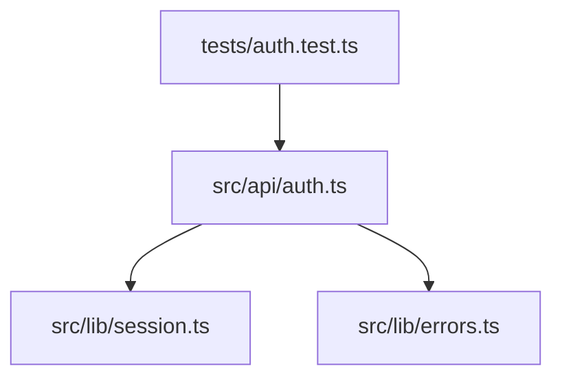

# VibeGraph — Final Product SPEC

## 1. Product Name

**VibeGraph**

## 2. Tagline

**Live codebase maps for AI-powered builders.**

## 3. One-liner

VibeGraph is a one-command local tool that turns a hackathon repo into a live Obsidian-like codebase graph and recommends the exact files builders should give to their AI coding tools.

## 4. Product Summary

VibeGraph helps hackathon builders understand, debug, and document fast-moving codebases during intense build sessions.

A user opens a terminal inside a project and runs:

```bash
npx vibegraph@latest .
```

VibeGraph scans the local repository, builds a file-level import graph for Python, JavaScript, and TypeScript, opens a local dashboard, watches file changes, warns about broken dependencies, and generates AI-ready context packs for coding assistants such as Cursor, GitHub Copilot, Claude Code, or any LLM-based coding workflow.

The core AI feature is not code generation. Instead, VibeGraph acts as a **Graph-Aware Context-Pruning Agent**. Given a task like:

```text
Fix login error handling in auth.ts
```

VibeGraph identifies the relevant subgraph, ranks related files, creates a copyable prompt, and writes a structured context file to:

```text
.vibegraph/context.md
```

The product is local-first, self-contained, and designed for hackathon teams that need to ship quickly without losing architectural control.

---

# 5. Competition Fit

## 5.1 Target Track

**Builder Experience Award — Agentic AI Build Week**

## 5.2 Why VibeGraph Fits

VibeGraph improves the builder journey during the live event by helping teams:

* Understand unfamiliar or rapidly changing repos.
* Avoid wasting time manually tracing dependencies.
* Reduce AI context bloat.
* Detect broken imports earlier.
* Generate README and architecture documentation faster for submission.
* Onboard teammates and mentors into a codebase quickly.

## 5.3 Differentiation From a Thin Chatbot

VibeGraph is not a chat UI over an LLM. The AI layer is tool-driven and graph-aware.

The agent must use structured repo data before producing output:

```text
User task → graph query → subgraph retrieval → file ranking → context pack generation
```

The product has a real workflow around local code analysis, graph visualization, file watching, and context pruning.

---

# 6. Target Users

## 6.1 Primary User

A hackathon builder working on an AI product during Agentic AI Build Week.

Typical context:

* Working under time pressure.
* Using AI coding tools heavily.
* Modifying a repo with teammates.
* Needs to debug, integrate, document, and demo quickly.

## 6.2 Secondary Users

### New teammate

Someone who joins the repo mid-event and needs to understand the architecture quickly.

### Mentor

A technical mentor who wants to inspect a team’s repo quickly and give useful guidance.

### Solo builder

A builder who uses AI coding tools but wants to avoid dumping the entire repo into the context window.

---

# 7. Problem Statement

During a hackathon, codebases change quickly. Builders often use AI coding agents to generate or modify files, while multiple teammates work in parallel. This creates three concrete problems:

## 7.1 Architecture drift

Builders lose track of which files depend on each other. A small change can break an import, route, tool, or module relationship without immediate visibility.

## 7.2 Context overload

When asking an AI coding tool for help, builders often include too many files because they do not know the minimal relevant context. This wastes tokens, increases cost, and reduces answer quality.

## 7.3 Submission friction

Near demo time, teams need a clear README, architecture diagram, and explanation of how the project works. Writing these manually costs valuable build time.

---

# 8. Product Goals

## 8.1 Primary Goals

1. Let a builder launch the product with one command.
2. Visualize the repo as a live file-level import graph.
3. Recommend the right files to include in an AI coding task.
4. Detect broken imports or dependency issues in near real time.
5. Generate a README draft with architecture information.

## 8.2 Success Definition

VibeGraph succeeds if a builder can:

1. Run `npx vibegraph@latest .`.
2. See an Obsidian-like graph of the repo.
3. Click a file and inspect its dependencies.
4. Ask for context for a coding task.
5. Get a concise context pack.
6. Save the context pack to `.vibegraph/context.md`.
7. Generate `.vibegraph/README.generated.md`.
8. See a warning when a dependency breaks.

---

# 9. Non-goals

The MVP will not attempt to provide:

* Full function-level call graph.
* Full semantic code understanding.
* Automatic code modification.
* IDE extension.
* Cloud repo ingestion.
* Multi-user collaboration.
* Production-grade static analysis.
* Security scanning.
* Support for all programming languages.
* Perfect handling of every dynamic import pattern.

---

# 10. Locked Product Decisions

## 10.1 Launch Command

```bash
npx vibegraph@latest .
```

## 10.2 Language Support

MVP supports:

* Python
* JavaScript
* TypeScript

## 10.3 Graph Granularity

MVP focuses on:

```text
file-level import graph
```

Function-level call graph is out of scope for MVP.

## 10.4 AI Behavior

The AI only recommends context. It does not modify source code.

## 10.5 Output Files

VibeGraph writes generated artifacts to:

```text
.vibegraph/
```

Required files:

```text
.vibegraph/graph.json
.vibegraph/context.md
.vibegraph/README.generated.md
.vibegraph/warnings.json
```

## 10.6 LLM Provider

The LLM provider is OpenRouter-compatible and uses a Gemini model.

Recommended environment variables:

```bash
OPENROUTER_API_KEY=...
VIBEGRAPH_MODEL=google/gemini-2.0-flash-001
```

For convenience, the MVP may also accept:

```bash
GEMINI_API_KEY=...
```

as an alias if the team wants to keep the setup simple.

## 10.7 Offline / No API Key Mode

VibeGraph must run without an API key.

Without an API key, the following features still work:

* Repo scanning.
* Graph generation.
* Dashboard.
* File metadata.
* Realtime watcher.
* Warning console.
* Basic non-AI context recommendation using graph heuristics.

Disabled or degraded without API key:

* AI-written task explanation.
* AI-generated README narrative.
* AI-enhanced prompt writing.

## 10.8 Frontend Stack

```text
React
Vite
TypeScript
TailwindCSS
react-force-graph-2d
```

## 10.9 Backend Stack

```text
Python
FastAPI
Uvicorn
NetworkX
Watchdog
Tree-sitter or fallback parsers
OpenRouter-compatible LLM client
```

## 10.10 Demo Repo

The demo repo should use:

```text
FastAPI + React + simple agent tools
```

---

# 11. Product Architecture

## 11.1 High-level Architecture

```text
npm CLI package
  └── starts local VibeGraph runtime
        ├── Python backend
        │     ├── Scanner service
        │     ├── Parser service
        │     ├── Graph service
        │     ├── Watcher service
        │     ├── Context agent service
        │     └── README generator
        │
        ├── Local API server
        │     ├── REST endpoints
        │     └── WebSocket stream
        │
        └── React dashboard
              ├── Obsidian-like graph canvas
              ├── File inspector
              ├── Context pack panel
              ├── Warning console
              └── README generator panel
```

## 11.2 Runtime Flow

```text
User runs command
  ↓
CLI resolves project path
  ↓
Backend scans repo
  ↓
Parser extracts imports and metadata
  ↓
NetworkX builds file-level graph
  ↓
Dashboard opens
  ↓
Watcher listens for file changes
  ↓
Context agent uses graph to recommend files
```

---

# 12. CLI Specification

## 12.1 Primary Command

```bash
npx vibegraph@latest .
```

## 12.2 Optional Commands

```bash
npx vibegraph@latest ./path-to-project
npx vibegraph@latest . --port 8732
npx vibegraph@latest . --no-open
npx vibegraph@latest . --rescan
npx vibegraph@latest . --model google/gemini-2.0-flash-001
```

## 12.3 Expected Terminal Output

```text
VibeGraph starting...

Project: /Users/hieu/demo-agent-app
Languages detected: Python, TypeScript
Files scanned: 84
Import edges found: 132
Warnings: 3

Dashboard: http://localhost:8732
Watching for file changes...
```

## 12.4 Error Handling

If the target path is invalid:

```text
[ERROR] Project path does not exist: ./wrong-path
```

If no supported files are found:

```text
[WARN] No Python, JavaScript, or TypeScript files found.
```

If no API key is found:

```text
[INFO] No LLM API key found. Running in local graph-only mode.
```

---

# 13. Repo Scanner Specification

## 13.1 Included File Types

```text
.py
.js
.jsx
.ts
.tsx
```

## 13.2 Ignored Directories

```text
.git
node_modules
venv
.venv
__pycache__
.next
dist
build
coverage
.cache
.turbo
.vibegraph
```

## 13.3 Ignored Files

```text
package-lock.json
pnpm-lock.yaml
yarn.lock
poetry.lock
*.min.js
*.map
```

## 13.4 Scanner Output

The scanner produces a list of file records:

```json
{
  "path": "src/api/auth.ts",
  "language": "typescript",
  "loc": 184,
  "sizeBytes": 6421,
  "lastModified": "2026-06-19T10:00:00Z"
}
```

---

# 14. Parser Specification

## 14.1 Python Extraction

Extract:

* `import module`
* `import module as alias`
* `from module import symbol`
* top-level functions
* top-level classes
* approximate LOC

Example:

```python
from app.services.session import validate_session
from app.errors import AuthError
```

Output:

```json
{
  "imports": [
    {
      "module": "app.services.session",
      "symbols": ["validate_session"]
    },
    {
      "module": "app.errors",
      "symbols": ["AuthError"]
    }
  ],
  "exports": ["login", "logout", "AuthController"]
}
```

## 14.2 JavaScript / TypeScript Extraction

Extract:

* `import x from "..."`
* `import { x } from "..."`
* `import * as x from "..."`
* `export function`
* `export class`
* `export const`
* `export default`
* dynamic `import()` when simple

Example:

```ts
import { validateSession } from "../lib/session";
import { AuthError } from "../lib/errors";
```

Output:

```json
{
  "imports": [
    {
      "module": "../lib/session",
      "symbols": ["validateSession"]
    },
    {
      "module": "../lib/errors",
      "symbols": ["AuthError"]
    }
  ],
  "exports": ["login", "logout"]
}
```

---

# 15. Graph Engine Specification

## 15.1 Graph Type

Directed graph.

```text
File A imports File B
A → B
```

## 15.2 Node Types

```text
file
folder
entrypoint
test
config
unknown
```

## 15.3 Edge Types

```text
imports
imports_symbol
dynamic_import
test_targets
broken_import
```

## 15.4 Node Data Model

```json
{
  "id": "src/api/auth.ts",
  "path": "src/api/auth.ts",
  "label": "auth.ts",
  "type": "file",
  "language": "typescript",
  "group": "backend",
  "loc": 184,
  "inDegree": 3,
  "outDegree": 5,
  "riskScore": 0.71,
  "isEntrypoint": false,
  "isOrphan": false,
  "hasWarning": true
}
```

## 15.5 Edge Data Model

```json
{
  "source": "src/api/auth.ts",
  "target": "src/lib/session.ts",
  "type": "imports",
  "symbols": ["validateSession"],
  "status": "healthy"
}
```

## 15.6 Graph JSON Output

Saved to:

```text
.vibegraph/graph.json
```

Shape:

```json
{
  "projectRoot": "/Users/hieu/demo-agent-app",
  "generatedAt": "2026-06-19T10:00:00Z",
  "nodes": [],
  "links": [],
  "stats": {
    "filesScanned": 84,
    "edgesFound": 132,
    "warnings": 3
  }
}
```

---

# 16. Dashboard Specification

## 16.1 Layout

```text
┌────────────────────────────────────────────────────────────┐
│ Top Bar: Project | Search | Rescan | Generate README       │
├───────────────────────┬────────────────────────────────────┤
│ Left Sidebar          │ Main Graph Canvas                  │
│ - Filters             │ react-force-graph-2d               │
│ - Warning count       │                                    │
│ - Context task input  │                                    │
├───────────────────────┴────────────────────────────────────┤
│ Bottom Warning Console                                      │
└────────────────────────────────────────────────────────────┘
```

## 16.2 Graph View

The graph should feel similar to Obsidian’s graph view.

Required interactions:

* Zoom.
* Pan.
* Drag node.
* Hover node.
* Click node.
* Double-click node to focus neighborhood.
* Search file.
* Toggle file graph / grouped module graph.
* Toggle orphan files.
* Toggle test files.
* Toggle config files.

## 16.3 Node Visual Rules

Node size:

```text
size = base_size + log(1 + in_degree + out_degree)
```

Node grouping:

```text
frontend: React, Vite, components, pages, app
backend: FastAPI, routes, api, services
agent: agents, tools, prompts, chains
test: test, spec, __tests__
config: package.json, pyproject.toml, tsconfig, vite config
warning: files with active warnings
orphan: no incoming or outgoing edges
```

## 16.4 File Inspector Panel

When a user clicks a node, show:

```text
File: src/api/auth.ts
Language: TypeScript
LOC: 184

Imports:
- src/lib/session.ts
- src/lib/errors.ts

Imported by:
- src/routes/login.ts
- tests/auth.test.ts

Exports:
- login
- logout

Warnings:
- validateSession missing from src/lib/session.ts

Actions:
[Create Context Pack]
[Copy @mentions]
[Open Context File]
```

---

# 17. Realtime Watcher Specification

## 17.1 Watcher Behavior

The watcher monitors supported source files.

When a file changes:

```text
file save
  ↓
debounce 500–1000ms
  ↓
re-parse changed file
  ↓
rebuild graph or affected subgraph
  ↓
detect warnings
  ↓
push update to dashboard
```

For MVP, full graph refresh after a debounced change is acceptable for small and medium demo repos.

## 17.2 Warning Types

```text
BROKEN_IMPORT
DELETED_IMPORTED_FILE
MISSING_EXPORTED_SYMBOL
NEW_ORPHAN_FILE
NEW_CIRCULAR_DEPENDENCY
```

## 17.3 Warning Data Model

```json
{
  "level": "warn",
  "type": "MISSING_EXPORTED_SYMBOL",
  "message": "src/api/auth.ts imports validateSession from src/lib/session.ts, but validateSession no longer exists.",
  "source": "src/api/auth.ts",
  "target": "src/lib/session.ts",
  "symbol": "validateSession",
  "timestamp": "2026-06-19T10:02:00Z"
}
```

## 17.4 Warning Output

Saved to:

```text
.vibegraph/warnings.json
```

Displayed in dashboard:

```text
[WARN] src/api/auth.ts imports validateSession from src/lib/session.ts, but validateSession no longer exists.
```

---

# 18. Context Pack Agent Specification

## 18.1 Purpose

The Context Pack Agent recommends a minimal set of files for an AI coding task.

It does not modify code.

## 18.2 User Input

Example:

```text
Fix login error handling in auth.ts
```

## 18.3 Agent Process

```text
1. Parse the user task.
2. Identify likely target files.
3. Query the graph.
4. Retrieve direct imports.
5. Retrieve direct importers.
6. Retrieve relevant test files.
7. Rank candidate files.
8. Generate context pack.
9. Save context pack to .vibegraph/context.md.
10. Show copyable prompt in dashboard.
```

## 18.4 File Ranking Formula

```text
score =
  0.40 * target_match
+ 0.25 * graph_distance
+ 0.15 * symbol_overlap
+ 0.10 * test_relevance
+ 0.10 * recent_change
```

## 18.5 Default Context Rules

```text
max_files: 8
max_depth: 2
include_tests: true
include_config: false
include_docs: false
```

Always include:

* Explicitly mentioned file.
* Direct imports.
* Direct importers.
* Relevant tests when detected.

Exclude by default:

* Generated files.
* Build artifacts.
* Lockfiles.
* Dependency folders.
* Unrelated docs.

## 18.6 Dashboard Output

```text
Recommended context for: "Fix login error handling in auth.ts"

Include these files:
1. src/api/auth.ts — target file
2. src/lib/session.ts — direct dependency
3. src/lib/errors.ts — shared error types
4. tests/auth.test.ts — relevant test coverage

Copy this prompt:
"Fix login error handling in src/api/auth.ts. Preserve the session contract in src/lib/session.ts and update tests in tests/auth.test.ts if needed."

Estimated context size: 7,900 tokens
Reduction: 84% smaller than full repo context
```

## 18.7 File Output

Saved to:

```text
.vibegraph/context.md
```

Example:

```md
# VibeGraph Context Pack

## Task

Fix login error handling in `src/api/auth.ts`.

## Files to include

- `src/api/auth.ts`
- `src/lib/session.ts`
- `src/lib/errors.ts`
- `tests/auth.test.ts`

## Why these files

- `src/api/auth.ts`: target file.
- `src/lib/session.ts`: direct dependency.
- `src/lib/errors.ts`: shared error model.
- `tests/auth.test.ts`: test file connected to auth flow.

## Suggested Prompt

Fix login error handling in `src/api/auth.ts`. Preserve the session contract in `src/lib/session.ts`. Use existing error classes from `src/lib/errors.ts`. Update `tests/auth.test.ts` if behavior changes.
```

---

# 19. README Generator Specification

## 19.1 Purpose

Generate a submission-ready README draft from the current codebase graph.

## 19.2 Input

* Project name.
* Graph summary.
* Entry points.
* Main modules.
* Detected scripts.
* Warnings.
* Optional user-provided project description.

## 19.3 Output File

```text
.vibegraph/README.generated.md
```

## 19.4 README Sections

```md
# Project Name

## Overview

## Architecture

## Main Modules

## Mermaid Diagram

## How to Run

## Key Files

## Known Architecture Warnings

## Generated by VibeGraph
```

## 19.5 Mermaid Output

Example:



---

# 20. API Specification

## 20.1 REST Endpoints

```text
GET /api/health
GET /api/project
GET /api/graph
GET /api/files/{file_path}
GET /api/warnings
POST /api/rescan
POST /api/context-pack
POST /api/readme
```

## 20.2 WebSocket Endpoint

```text
WS /ws/events
```

## 20.3 WebSocket Events

```json
{
  "type": "graph_updated",
  "payload": {
    "nodes": [],
    "links": []
  }
}
```

```json
{
  "type": "warning_created",
  "payload": {
    "level": "warn",
    "message": "Broken import detected."
  }
}
```

---

# 21. User Stories and Acceptance Criteria by Phase

## Phase 0 — Project Foundation

### Objective

Set up the monorepo, development workflow, basic CLI structure, backend, and frontend shell.

### User Story 0.1 — Developer can run the local dev environment

As a developer, I want to run the VibeGraph development environment locally so that I can build and test the product quickly.

#### Acceptance Criteria

* The repo contains clear `frontend`, `backend`, and `cli` workspaces.
* The developer can run the backend locally.
* The developer can run the frontend locally.
* The frontend can call the backend health endpoint.
* The README contains local development instructions.
* No LLM API key is required for local development startup.

### User Story 0.2 — System has a stable output directory

As a user, I want generated files to be placed in a predictable directory so that I can find graph data, context packs, and generated README files easily.

#### Acceptance Criteria

* VibeGraph creates `.vibegraph/` if it does not exist.
* `.vibegraph/graph.json` is reserved for graph output.
* `.vibegraph/context.md` is reserved for context pack output.
* `.vibegraph/README.generated.md` is reserved for generated README output.
* `.vibegraph/warnings.json` is reserved for warning output.
* `.vibegraph/` is ignored by the scanner.

---

## Phase 1 — One-command Scanner and Graph Builder

### Objective

Allow a user to scan a local repo and generate a file-level import graph.

### User Story 1.1 — User can run VibeGraph with one command

As a builder, I want to run `npx vibegraph@latest .` inside my repo so that I can start VibeGraph without manual setup.

#### Acceptance Criteria

* The command accepts a project path argument.
* The command defaults to the current directory if `.` is provided.
* The command validates that the path exists.
* The command starts the backend server.
* The command starts or serves the frontend dashboard.
* The command prints the dashboard URL.
* The command does not fail if no API key is present.
* The command prints a clear message when running in no-API-key mode.

### User Story 1.2 — Scanner ignores irrelevant files

As a builder, I want VibeGraph to ignore dependency folders and generated files so that the graph stays useful and fast.

#### Acceptance Criteria

* Scanner ignores `.git`.
* Scanner ignores `node_modules`.
* Scanner ignores `venv` and `.venv`.
* Scanner ignores `.next`, `dist`, `build`, and `coverage`.
* Scanner ignores `.vibegraph`.
* Scanner ignores lockfiles by default.
* Scanner only includes `.py`, `.js`, `.jsx`, `.ts`, and `.tsx`.

### User Story 1.3 — Scanner detects supported languages

As a builder, I want VibeGraph to detect Python, JavaScript, and TypeScript files so that mixed hackathon repos are supported.

#### Acceptance Criteria

* Python files are detected.
* JavaScript files are detected.
* TypeScript files are detected.
* JSX and TSX files are detected.
* The terminal output includes detected languages.
* The graph output includes language metadata per file.

### User Story 1.4 — Parser extracts file-level imports

As a builder, I want VibeGraph to extract imports so that I can see how files depend on each other.

#### Acceptance Criteria

* Python `import x` is parsed.
* Python `from x import y` is parsed.
* JS/TS default imports are parsed.
* JS/TS named imports are parsed.
* JS/TS namespace imports are parsed.
* Relative imports are resolved to local file paths when possible.
* Unresolved imports are marked without crashing the scanner.
* Each import creates a directed edge in the graph when resolvable.

### User Story 1.5 — Graph JSON is generated

As a builder, I want VibeGraph to write a graph JSON file so that the dashboard and agent can consume structured repo data.

#### Acceptance Criteria

* `.vibegraph/graph.json` is created after scan.
* The file contains `nodes`.
* The file contains `links`.
* Each node has `id`, `path`, `label`, `language`, `type`, `loc`, `inDegree`, and `outDegree`.
* Each link has `source`, `target`, `type`, and `status`.
* The JSON is valid and can be loaded by the frontend.

---

## Phase 2 — Obsidian-like Graph Dashboard

### Objective

Render the codebase graph in a visual, interactive, Obsidian-like dashboard.

### User Story 2.1 — User can see the codebase as a force-directed graph

As a builder, I want to see my repo as a graph so that I can understand the architecture visually.

#### Acceptance Criteria

* The dashboard loads graph data from the backend.
* The graph renders using `react-force-graph-2d`.
* Nodes represent files.
* Links represent import relationships.
* The user can zoom.
* The user can pan.
* The user can drag nodes.
* The graph remains usable with at least 100 nodes in the demo repo.

### User Story 2.2 — User can inspect a file node

As a builder, I want to click a file node so that I can understand its role and dependencies.

#### Acceptance Criteria

* Clicking a node opens a file inspector panel.
* The panel shows file path.
* The panel shows language.
* The panel shows LOC.
* The panel shows imports.
* The panel shows imported-by files.
* The panel shows exports when available.
* The panel shows warnings related to the file.
* The panel has a “Create Context Pack” action.

### User Story 2.3 — User can search for a file

As a builder, I want to search for a file by name or path so that I can quickly locate relevant code.

#### Acceptance Criteria

* The dashboard includes a search input.
* Search matches file names.
* Search matches partial paths.
* Matching nodes are highlighted.
* Selecting a search result focuses the graph on that node.
* The file inspector opens for the selected result.

### User Story 2.4 — User can filter graph noise

As a builder, I want to toggle tests, configs, and orphan files so that I can reduce visual noise.

#### Acceptance Criteria

* The dashboard has a toggle for test files.
* The dashboard has a toggle for config files.
* The dashboard has a toggle for orphan files.
* Toggling updates visible graph nodes and links.
* Hidden nodes do not break the graph view.
* Resetting filters restores the full graph.

### User Story 2.5 — User can switch graph mode

As a builder, I want to switch between file graph and grouped module graph so that I can inspect the repo at different levels.

#### Acceptance Criteria

* The dashboard includes a graph mode toggle.
* File graph mode shows individual files.
* Grouped module mode groups files by folder or module.
* The selected mode is clearly visible.
* Switching modes does not require restarting the app.

---

## Phase 3 — Context Pack Agent

### Objective

Recommend a minimal set of files for an AI coding task and generate a copyable context pack.

### User Story 3.1 — User can request context for a coding task

As a builder, I want to type a coding task into VibeGraph so that I can know which files to give my AI coding tool.

#### Acceptance Criteria

* Dashboard includes a task input box.
* User can submit a natural-language task.
* The agent identifies likely target files.
* The agent queries graph data before generating output.
* The agent returns a recommended file list.
* The output includes reasons for each selected file.
* The output includes a copyable prompt.

### User Story 3.2 — Agent recommends context without an API key

As a builder, I want basic context recommendation to work without an API key so that the product remains usable in offline or low-setup environments.

#### Acceptance Criteria

* If no API key is present, the system uses graph heuristics.
* The user receives a recommended file list.
* The user receives a basic prompt template.
* The UI clearly indicates that AI-enhanced wording is disabled.
* The feature does not crash without an API key.

### User Story 3.3 — Agent uses OpenRouter when API key is present

As a builder, I want VibeGraph to use an OpenRouter-compatible Gemini model when configured so that context packs have better explanations and prompts.

#### Acceptance Criteria

* The backend detects `OPENROUTER_API_KEY` or the configured alias.
* The backend uses the configured Gemini model.
* The LLM receives structured graph context, not the entire repo by default.
* The LLM output includes a concise rationale.
* The LLM output does not claim to edit files.
* If the LLM call fails, the system falls back to heuristic mode.

### User Story 3.4 — Context pack is saved to disk

As a builder, I want the context pack saved as a markdown file so that I can copy or version it easily.

#### Acceptance Criteria

* `.vibegraph/context.md` is created after generating a context pack.
* The file includes the task.
* The file includes recommended files.
* The file includes reasons.
* The file includes a suggested prompt.
* The dashboard includes a way to open or copy the generated content.

### User Story 3.5 — User can copy @mentions

As a builder using Cursor or similar tools, I want to copy file mentions so that I can quickly paste them into my AI coding workflow.

#### Acceptance Criteria

* The context pack panel includes a “Copy file mentions” button.
* The copied text includes recommended file paths.
* The copied text is formatted one path per line or as `@file` style.
* The UI confirms successful copy.

---

## Phase 4 — README Generator

### Objective

Generate a submission-ready README draft from the codebase graph.

### User Story 4.1 — User can generate a README

As a builder, I want VibeGraph to generate a README draft so that I can prepare my hackathon submission faster.

#### Acceptance Criteria

* Dashboard includes a “Generate README” action.
* The generator uses graph data.
* The generator identifies main modules.
* The generator identifies likely entry points.
* The generator creates `.vibegraph/README.generated.md`.
* The UI confirms file generation.

### User Story 4.2 — README includes architecture diagram

As a builder, I want the README to include a Mermaid architecture diagram so that judges and teammates can understand the system quickly.

#### Acceptance Criteria

* Generated README includes a Mermaid diagram.
* The Mermaid diagram is syntactically valid.
* The diagram contains important files or modules.
* The diagram does not include every file if the repo is large.
* The diagram prioritizes entry points and high-degree nodes.

### User Story 4.3 — README works without API key

As a builder, I want a basic README to be generated without an API key so that documentation still works in local-only mode.

#### Acceptance Criteria

* Without API key, the system generates a structured README template.
* The README includes project stats.
* The README includes architecture diagram.
* The README includes main files/modules.
* AI-written prose is skipped or replaced with deterministic text.
* The feature does not crash without an API key.

---

## Phase 5 — Realtime Warning MVP

### Objective

Watch file changes and surface dependency warnings in near real time.

### User Story 5.1 — User sees graph updates after saving a file

As a builder, I want the graph to update when I save a file so that I can see architectural changes as I code.

#### Acceptance Criteria

* Watcher detects changes to supported files.
* File events are debounced.
* Changed files are re-parsed.
* Graph data is updated.
* Dashboard receives an update through WebSocket or refresh polling.
* The graph reflects the change without restarting VibeGraph.

### User Story 5.2 — User sees broken import warnings

As a builder, I want to be warned when an import breaks so that I can fix the issue before demo time.

#### Acceptance Criteria

* If an imported local file is deleted, a warning is created.
* If an imported symbol disappears, a warning is created when detectable.
* The warning appears in the dashboard warning console.
* The warning is saved to `.vibegraph/warnings.json`.
* The related node is visually marked in the graph.
* The related edge is marked as broken.

### User Story 5.3 — User sees orphan file warnings

As a builder, I want to know when a file becomes isolated so that I can detect unused or disconnected code.

#### Acceptance Criteria

* A file with no incoming or outgoing local import edges is marked as orphan.
* New orphan files can be shown in warnings.
* Orphan nodes can be toggled in the dashboard.
* Orphan detection does not include ignored files.

### User Story 5.4 — User sees circular dependency warnings

As a builder, I want to know when circular dependencies appear so that I can avoid architecture problems.

#### Acceptance Criteria

* Graph engine detects simple directed cycles.
* New circular dependencies are added to warnings.
* The dashboard displays affected files.
* The graph visually highlights the cycle when possible.
* The feature works at least for small demo cycles.

---

## Phase 6 — Packaging, Landing Page, and Demo

### Objective

Prepare the project for public voting, Devpost submission, and live demo.

### User Story 6.1 — User can install and run from npm

As a builder, I want to run VibeGraph through npm/npx so that the product feels simple and real.

#### Acceptance Criteria

* npm package exposes a `vibegraph` binary.
* `npx vibegraph@latest .` starts the app.
* The command works on a fresh clone of the demo repo.
* The command prints clear startup logs.
* The command opens or prints the dashboard URL.
* The README documents the command.

### User Story 6.2 — Visitor can understand product from landing page

As a voter or judge, I want to understand VibeGraph from a landing page so that I can evaluate and vote for it quickly.

#### Acceptance Criteria

* Landing page includes one-liner.
* Landing page includes demo video or GIF.
* Landing page explains the problem.
* Landing page explains the solution.
* Landing page shows the command.
* Landing page links to GitHub.
* Landing page links to Devpost when available.
* Landing page clearly states that the product is local-first.

### User Story 6.3 — Judge can watch a complete demo

As a judge, I want to see the product solve a concrete builder problem so that I can assess usefulness.

#### Acceptance Criteria

* Demo shows one-command launch.
* Demo shows graph dashboard.
* Demo shows file inspection.
* Demo shows context pack generation.
* Demo shows `.vibegraph/context.md`.
* Demo shows README generation.
* Demo shows at least one realtime warning.
* Demo uses a FastAPI + React + simple agent tools repo.

---

# 22. Demo Repo Specification

## 22.1 Recommended Structure

```text
demo-agent-app/
  backend/
    app/
      main.py
      api/
        auth.py
        users.py
      services/
        session.py
        errors.py
      agents/
        planner.py
        tools.py
    tests/
      test_auth.py

  frontend/
    src/
      App.tsx
      pages/
        LoginPage.tsx
      components/
        AuthForm.tsx
      lib/
        api.ts

  README.md
  package.json
  pyproject.toml
```

## 22.2 Intentional Demo Scenario

Create a dependency chain:

```text
auth.py → session.py → errors.py
test_auth.py → auth.py
LoginPage.tsx → api.ts
api.ts → backend auth route conceptually
```

Then during demo:

1. Rename or remove `validate_session` from `session.py`.
2. Save file.
3. VibeGraph emits warning.
4. Broken node/edge appears in graph.
5. User asks:

```text
Fix login error handling in auth.py
```

6. VibeGraph recommends:

```text
backend/app/api/auth.py
backend/app/services/session.py
backend/app/services/errors.py
backend/tests/test_auth.py
```

---

# 23. Demo Script

## Step 1 — Launch

```bash
cd demo-agent-app
npx vibegraph@latest .
```

Show terminal output and dashboard URL.

## Step 2 — Show Graph

Show the Obsidian-like graph.

Say:

```text
This is the repo architecture as a live file-level import graph.
```

## Step 3 — Inspect Auth Flow

Search for:

```text
auth
```

Click `auth.py`.

Show:

* Imports.
* Imported-by files.
* Connected tests.
* Risk score.

## Step 4 — Break Dependency

In `session.py`, rename:

```python
validate_session
```

to:

```python
verify_session
```

Save file.

## Step 5 — Show Warning

Show dashboard warning:

```text
[WARN] auth.py imports validate_session from session.py, but validate_session no longer exists.
```

## Step 6 — Generate Context Pack

Enter task:

```text
Fix login error handling in auth.py
```

Show output:

* Recommended files.
* Reasons.
* Copyable prompt.
* Token reduction estimate.

## Step 7 — Open Context File

Open:

```text
.vibegraph/context.md
```

## Step 8 — Generate README

Click:

```text
Generate README
```

Open:

```text
.vibegraph/README.generated.md
```

Show Mermaid diagram.

## Step 9 — Close With Metric

Example closing line:

```text
Instead of giving the AI our entire repo, VibeGraph reduced the task context from 42 files to 4 files — an estimated 90% reduction.
```

---

# 24. Success Metrics

## 24.1 Product Metrics

* Time to first graph: under 30 seconds for demo repo.
* Context reduction: at least 60% fewer files than full repo.
* Broken dependency warning latency: under 2 seconds after save for demo repo.
* Dashboard usable with at least 100 nodes.
* Context pack generated in under 10 seconds.
* README generated in under 15 seconds.

## 24.2 Hackathon Metrics

* Demo can be completed in under 5 minutes.
* Product can run without internal event systems.
* Product uses mock/local data only.
* Product demonstrates meaningful AI workflow.
* Product solves a builder pain point during build/demo days.
* Product has a clear README and run command.

---

# 25. Risk Register

## Risk 1 — Scope creep

### Risk

Trying to build full semantic code intelligence may exceed the hackathon timeline.

### Mitigation

Keep MVP to file-level import graph.

## Risk 2 — Parser accuracy

### Risk

Dynamic imports and complex path aliases may not resolve correctly.

### Mitigation

Support common import patterns first. Mark unresolved imports instead of failing.

## Risk 3 — Graph noise

### Risk

Large repos may produce unreadable graphs.

### Mitigation

Add filters, search, and grouped module mode.

## Risk 4 — LLM dependency

### Risk

API keys may be missing or model calls may fail.

### Mitigation

Support no-API-key mode and heuristic context recommendation.

## Risk 5 — npm packaging complexity

### Risk

Packaging Python backend behind an npm CLI may take time.

### Mitigation

Use a Node CLI wrapper that starts the local backend. Keep a documented fallback:

```bash
pnpm dev
```

## Risk 6 — Realtime watcher bugs

### Risk

Incremental updates may be complex.

### Mitigation

Use debounced full graph refresh for MVP.

---

# 26. Recommended Build Order

## Day 1

Build scanner, parser, graph engine, and `.vibegraph/graph.json`.

## Day 2

Build FastAPI backend and React dashboard with `react-force-graph-2d`.

## Day 3

Build file inspector, search, filters, and graph mode toggle.

## Day 4

Build Context Pack Agent, no-API-key heuristic mode, and `.vibegraph/context.md`.

## Day 5

Build README generator and Mermaid diagram output.

## Day 6

Build realtime watcher MVP and warning console.

## Day 7

Package npm command, polish landing page, record demo video, prepare Devpost submission.

---

# 27. Final MVP Checklist

The MVP is complete when all of the following are true:

* `npx vibegraph@latest .` launches the app.
* Python, JS, and TS files are scanned.
* `.vibegraph/graph.json` is generated.
* Dashboard displays an Obsidian-like graph.
* User can search for a file.
* User can inspect file metadata.
* User can toggle file graph and grouped module graph.
* User can generate a context pack.
* `.vibegraph/context.md` is generated.
* User can generate a README.
* `.vibegraph/README.generated.md` is generated.
* Watcher detects file changes.
* Broken imports create warnings.
* Warnings appear in the dashboard.
* Product works without an API key.
* Product uses OpenRouter/Gemini when API key is present.
* Demo repo shows FastAPI + React + simple agent tools.
* Landing page explains the product clearly.
* Demo video shows the full workflow.

---

# 28. Final Product Pitch

During Agentic AI Build Week, builders move fast, use AI coding tools constantly, and often lose track of how their repo is changing. VibeGraph gives them a live map of their codebase and tells them exactly which files to give their AI assistant.

With one command, VibeGraph scans the repo, opens an Obsidian-like graph, watches for broken dependencies, recommends minimal context for coding tasks, and generates architecture documentation for submission.

It helps builders ship faster, reduce context noise, and keep their demo repo understandable under pressure.
